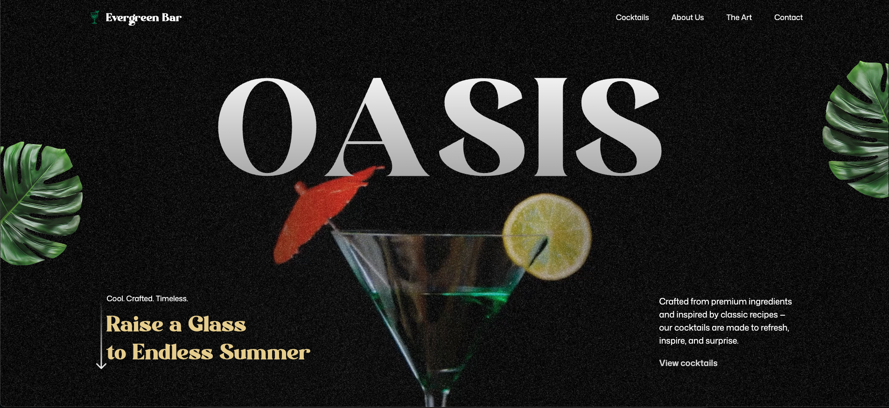
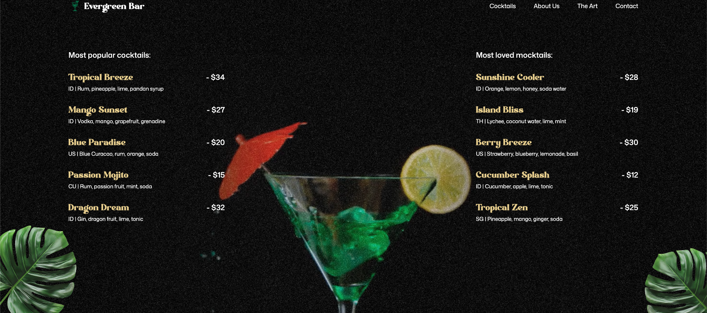
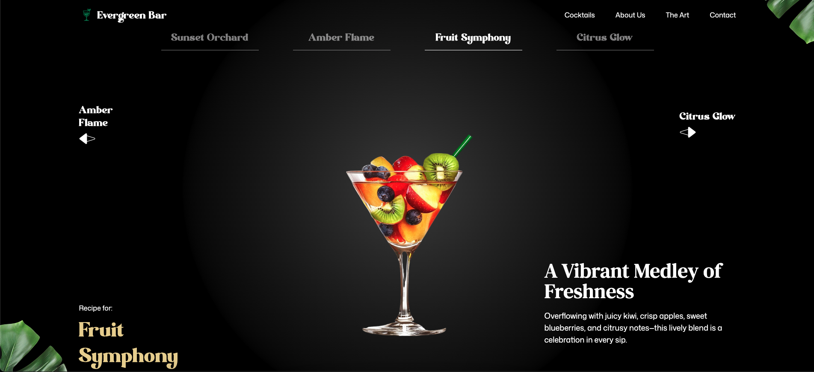
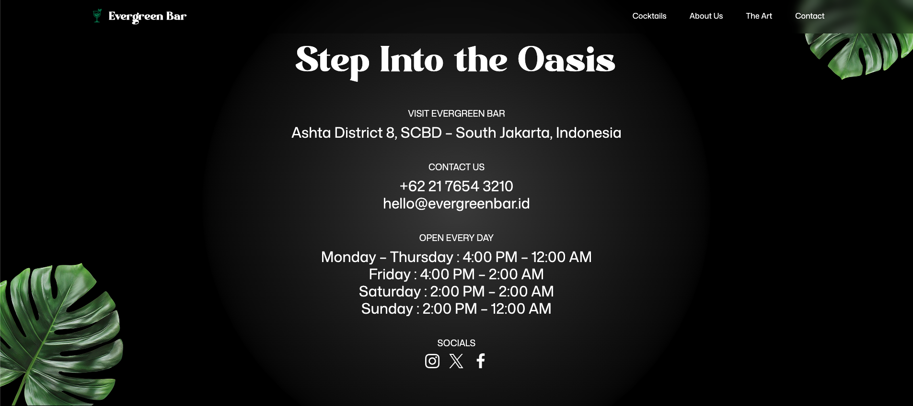
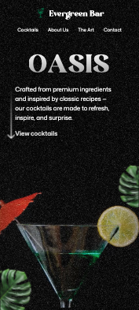
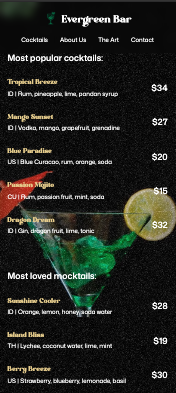

# Evergreen Bar

A modern web application for bars & cocktail lounges, featuring drink menus, bar profiles, and interactive animations built with React, GSAP, and Tailwind CSS.

## Main Features

- **Interactive Landing Page**: Text and element animations using GSAP & SplitText.
- **Blurred & Sticky Navbar**: Navigation stays on top with a blur effect on scroll.
- **Cocktail & Mocktail Menu**: Complete drink list with details and prices.
- **About, Art, Popular, Contact Sections**: Bar profile, gallery, opening hours, and contact info.
- **Responsive Design**: Optimized for both mobile & desktop.
- **Custom Fonts & Styling**: Uses Modern Negra and DM Serif Text fonts.

## Technology Stack

- **React 19**
- **Vite**
- **GSAP (GreenSock Animation Platform)**
- **Tailwind CSS 4**
- **React Responsive**

## Project Structure

```
evergreen_bar/
├── public/
│   ├── fonts/Modern Negra Demo.ttf
│   ├── images/...
│   └── videos/output.mp4
├── src/
│   ├── components/
│   │   ├── Navbar.jsx, Hero.jsx, About.jsx, Art.jsx, Menus.jsx, Popular.jsx, Contact.jsx
│   │   └── index.js
│   ├── constants/index.js
│   ├── App.jsx
│   ├── main.jsx
│   └── index.css
├── tailwind.config.js
├── vite.config.js
└── package.json
```

## Screenshots

Showcase of the Evergreen Bar UI:

**Home Section**


**Popular Menu Section**


**Menu Section**


**Contact Section**


**Mobile View**

<p align="center">
  
  
</p>

## Installation & Usage

1. **Clone the repository**

   ```bash
   git clone https://github.com/bransyahtan/evergreen_bar.git
   cd evergreen_bar
   ```

2. **Install dependencies**

   ```bash
   npm install
   ```

3. **Start the development server**

   ```bash
   npm run dev
   ```

4. **Build for production**
   ```bash
   npm run build
   ```

## Configuration & Notes

- **Custom Font**: Modern Negra font is loaded from `public/fonts/Modern Negra Demo.ttf` and used for main headings.
- **GSAP Animations**: Some animations (especially SplitText) are triggered after fonts are loaded to avoid glitches.
- **Tailwind CSS**: Utilities and components are customized in `src/index.css`.
- **Assets**: All images and videos are located in `public/images` and `public/videos` folders.

## Component Structure

- **Navbar**: Main navigation with blur effect on scroll.
- **Hero**: Main section with animated text, images, and video.
- **Popular, About, Art, Menus, Contact**: Informative and interactive sections tailored for the bar.

## Contributing

1. Fork this repository
2. Create a feature branch: `git checkout -b new-feature`
3. Commit your changes: `git commit -m 'Add new feature'`
4. Push to the branch: `git push origin new-feature`
5. Open a Pull Request
